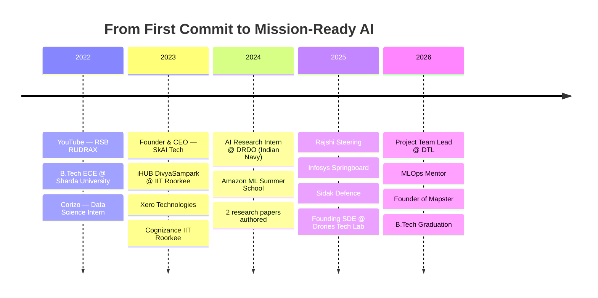

<!-- ═══════════════════════════════════════════════════════════════════════════
     README.md  —  rudraksh2611
     Paste EVERYTHING below into your profile repo's README.md
     Setup notes are in the HTML comment at the very bottom.
     ═══════════════════════════════════════════════════════════════════════ -->

<a name="top"></a>

<!-- ══════════════════════ BANNER ══════════════════════ -->

<div align="center">
  
</div>

<!-- YOUR ORIGINAL LOGO GIF -->
<div align="center">
  
</div>

<div align="center">

  <a href="https://github.com/rudraksh2611">
    
  </a>

  <br/>

  <a href="https://linkedin.com/in/rudrakshonwork"></a>
  <a href="https://rudrakshsingh2611.wixsite.com/my-site"></a>
  <a href="mailto:workrsb2611@gmail.com"></a>
  <a href="https://youtube.com/@rsbrudrax3087"></a>
  <a href="https://github.com/rudraksh2611"></a>

  <br/><br/>

  
  
  
  
  
  

</div>

<!-- ══════════════════════ QUICK NAV ══════════════════════ -->

<div align="center">

### 🧭 Quick Navigation

<a href="#about">About</a> &nbsp;•&nbsp;
<a href="#stack">Tech Stack</a> &nbsp;•&nbsp;
<a href="#experience">Experience</a> &nbsp;•&nbsp;
<a href="#research">Patents & Research</a> &nbsp;•&nbsp;
<a href="#stats">Analytics</a> &nbsp;•&nbsp;
<a href="#snake">Contributions</a> &nbsp;•&nbsp;
<a href="#projects">Projects</a> &nbsp;•&nbsp;
<a href="#dsa">DSA</a> &nbsp;•&nbsp;
<a href="#honors">Honors</a> &nbsp;•&nbsp;
<a href="#connect">Connect</a>


</div>

<!-- ══════════════════════ ABOUT ══════════════════════ -->

<a name="about"></a>

##  About Me


```python
class Rudraksh:
    """Builds AI that has to work at the edge — often mid-flight."""

    def __init__(self):
        self.name      = "Rudraksh Singh Bhadauria"
        self.alias     = "RDX ⚡"
        self.role      = "Project Team Lead / Lead SDE @ Drones Tech Lab"
        self.founder_of = ["Mapster", "SkAI Tech (2023)"]
        self.education = "B.Tech ECE, Sharda University — Class of 2026"
        self.patents   = 5
        self.domains   = ["AI / ML", "Computer Vision", "UAV & Drones",
                          "Edge AI", "MLOps", "Generative & Agentic AI"]
        self.ask_me    = ["Software Development",
                          "Tech Career Guidance",
                          "Drones 🚁"]
        self.contact   = "workrsb2611@gmail.com"

    def current_focus(self):
        return "Mission-ready AI on resource-constrained hardware."

    def say_hi(self):
        print("Thanks for dropping by — let's build something 🚀")


me = Rudraksh()
me.say_hi()
```

<br clear="right"/>

- 🚁 &nbsp;**Project Team Lead @ Drones Tech Lab** — owning a confidential Indian defence-sector delivery end-to-end
- 🧠 &nbsp;Previously **AI Research Intern @ D.R.D.O. (WESSE — Indian Navy)** — vessel trajectory prediction on **20,000+ vessels** of AIS data
- ⚙️ &nbsp;**Inventor on 5 patents** and co-author of published ML research
- 🚀 &nbsp;**Founder of Mapster**; earlier founded **SkAI Tech** and shipped *Speak Me*, a voice-controlled home-automation product
- 🎓 &nbsp;Final-year **B.Tech (ECE) @ Sharda University** • **Amazon ML Summer School '24** • **UG Chanakya Fellow**
- 🧑‍🏫 &nbsp;Mentored **100+ students**; ran 1-on-1 **MLOps mentorship** on Freelancer.com
- 🌱 &nbsp;Currently deep in **DSA (C++)**, **Edge AI**, and **Agentic AI**
- 💬 &nbsp;Ask me about **Software Development, Tech Career Guidance & Drones**
- 📫 &nbsp;Reach me at **workrsb2611@gmail.com**
- ⚡ &nbsp;Fun fact: **they call me RDX** 😂

<details>
<summary><b>🎭 A few more things about me (click to expand)</b></summary>

<br/>

| | |
|---|---|
| 🛰️ &nbsp;**Day job** | AI Copilot features for Ground Control Stations flying in the Indian defence sector |
| 🧩 &nbsp;**Hard problem I like** | Shrinking a model until it fits an embedded board — without it getting dumb |
| 🚁 &nbsp;**Drone count** | 4 drone projects built, many more mentored, via the **Aerohelix Drone Club** |
| 🎬 &nbsp;**Past life** | Ran a YouTube channel, **RSB RUDRAX**, for 9 months |
| 🎵 &nbsp;**Off-screen** | Topped instrumental music — the one competition with zero compile errors |
| ☕ &nbsp;**Fuel** | Coffee, `git commit -m "fix"`, and one more LeetCode problem |
| 🗣️ &nbsp;**Happy to help with** | Resume reviews, internship prep, first-ML-project guidance |
| 🧠 &nbsp;**Philosophy** | Build it ugly, make it work, *then* make it elegant |

</details>

<div align="right"><a href="#top">⬆️ back to top</a></div>


<!-- ══════════════════════ TECH STACK ══════════════════════ -->

<a name="stack"></a>

## 🛠️ Tech Stack

<div align="center">

### 👨‍💻 Languages


### 🤖 AI / Machine Learning


### 🧪 Methods & Specialisations


### 📊 Data & Visualization


### 🌐 Backend, Data Stores & Deployment


### 🚁 Drones & Embedded


### 🧰 Tools & Environment


</div>

<details>
<summary><b>📈 Where I actually spend my time (click to expand)</b></summary>

<br/>

```text
Python              ████████████████████████░   92%
Machine Learning    ███████████████████████░░   88%
C++ / DSA           ██████████████████████░░░   85%
Deep Learning       ████████████████████░░░░░   80%
Computer Vision     ███████████████████░░░░░░   76%
Data Analysis       ███████████████████░░░░░░   76%
Drone / UAV Systems ██████████████████░░░░░░░   72%
Edge AI Deployment  █████████████████░░░░░░░░   68%
MLOps / DevOps      ███████████████░░░░░░░░░░   60%
GenAI & Agentic AI  ██████████████░░░░░░░░░░░   56%
```

</details>

<div align="right"><a href="#top">⬆️ back to top</a></div>


<!-- ══════════════════════ EXPERIENCE ══════════════════════ -->

<a name="experience"></a>

## 💼 Experience

<table>
<tr><td width="26%"><b>🚁 Drones Tech Lab</b><br/><sub>Rchobbytech Solutions Pvt. Ltd.</sub></td>
<td width="26%"><b>Project Team Lead</b><br/><sub>Dec 2025 – Present · Kolkata</sub></td>
<td>End-to-end ownership of a <b>confidential Indian defence-sector delivery</b> under NDA — planning, software development, quality, and secure release management.</td></tr>

<tr><td></td>
<td><b>Founding Software Engineer</b><br/><sub>Aug 2025 – Dec 2025 · Hyderabad</sub></td>
<td>Led the <b>AI Copilot Team</b> building AI-driven features for a <b>Ground Control Station</b> deployed in the Indian defence sector. Designed, trained and optimised models for <b>edge computing</b> — real-time inference on resource-constrained hardware.</td></tr>

<tr><td><b>💻 Freelancer.com</b></td>
<td><b>MLOps Mentor</b><br/><sub>Jan 2026 – Apr 2026 · Noida</sub></td>
<td>1-on-1 mentorship for aspiring AI engineers across the full lifecycle: Python/DSA/Statistics → MongoDB & System Design → Deep Learning, GenAI & Agentic AI → DevOps + MLOps to production.</td></tr>

<tr><td><b>🛡️ Sidak Group of Companies</b></td>
<td><b>Software Engineer</b><br/><sub>Jul 2025 – Oct 2025 · Noida</sub></td>
<td>Built and managed comms between <b>onboard drone cameras and ground control</b>; implemented and optimised ML algorithms for real-time aerial data analysis and autonomous decision-making.</td></tr>

<tr><td><b>🧠 Infosys Springboard</b></td>
<td><b>AI Engineer (Intern)</b><br/><sub>Jul 2025 – Oct 2025 · Noida</sub></td>
<td>Selected in the <b>top 2,000 out of 2 lakh candidates</b> for the Infosys Springboard internship programme.</td></tr>

<tr><td><b>🚗 Rajshi Steering Pvt. Ltd.</b></td>
<td><b>Software Engineer</b><br/><sub>Jan 2025 – Feb 2025 · Faridabad</sub></td>
<td>Delivered a drone project centred on <b>ML-powered camera software</b>, trained on image datasets to improve visual accuracy and operational efficiency.</td></tr>

<tr><td><b>🇮🇳 DRDO</b><br/><sub>WESSE — Indian Navy</sub></td>
<td><b>AI Research Intern</b><br/><sub>Jun 2024 – Aug 2024 · Delhi</sub></td>
<td>Built an ML model predicting <b>vessel trajectories from AIS data across 20,000+ unique vessels</b> for maritime safety and collision prevention — anomaly detection, <b>HDBSCAN clustering</b>, trajectory pattern recognition, time-series and geospatial modelling. <b>Authored 2 research papers</b> under a senior DRDO scientist; earned a <b>Letter of Recommendation</b>.</td></tr>

<tr><td><b>📦 Amazon</b></td>
<td><b>ML Summer School Mentee</b><br/><sub>Jul 2024 · India</sub></td>
<td>Supervised & unsupervised learning, deep neural networks, dimensionality reduction, sequential learning, reinforcement learning, <b>Generative AI & LLMs</b>, and causal inference.</td></tr>

<tr><td><b>🏛️ iHUB DivyaSampark</b><br/><sub>@ IIT Roorkee</sub></td>
<td><b>R&D Intern / Fellow</b><br/><sub>Aug 2023 – May 2024 · 10 months</sub></td>
<td>Nationally selected fellowship. Took the <b>SkAI project</b> from concept to a working build while competing in hackathons throughout the programme.</td></tr>

<tr><td><b>🎙️ SkAI Tech</b></td>
<td><b>Founder & CEO</b><br/><sub>Jan 2023 – Dec 2023 · Noida</sub></td>
<td>Built <b><i>Speak Me</i></b> — affordable voice-enabled home automation: a smart switchboard with manual + Wi-Fi control, so Indian homes get smart <i>without</i> replacing every appliance. NLP, voice-assistant integration, prompt engineering, API development, IoT. <a href="https://skaitech.vercel.app/">skaitech.vercel.app</a></td></tr>

<tr><td><b>⚡ Xero Technologies</b></td>
<td><b>Software Engineer</b><br/><sub>Jul 2023 – Aug 2023 · Hyderabad</sub></td>
<td>Product delivery across web development, ML/DL and data analytics alongside engineers from Microsoft, Google, Airtel and Standard Chartered.</td></tr>

<tr><td><b>🎓 Cognizance, IIT Roorkee</b></td>
<td><b>Student Partnership Program</b><br/><sub>Feb 2023 – Mar 2023 · Roorkee</sub></td>
<td>Campus lead for IIT Roorkee's tech fest at Sharda University. Earned a <b>Letter of Recommendation</b>.</td></tr>

<tr><td><b>📊 Corizo</b></td>
<td><b>Data Science Intern</b><br/><sub>Dec 2022 – Feb 2023</sub></td>
<td>Feature engineering, exploratory data analysis, and advanced Excel workflows.</td></tr>

<tr><td><b>▶️ YouTube</b></td>
<td><b>Content Creator</b><br/><sub>May 2022 – Jan 2023 · Gwalior</sub></td>
<td>Ran the channel <b><a href="https://youtube.com/@rsbrudrax3087">RSB RUDRAX</a></b> — tech content and project breakdowns.</td></tr>
</table>

### 🗺️ Journey



<div align="right"><a href="#top">⬆️ back to top</a></div>


<!-- ══════════════════════ RESEARCH & PATENTS ══════════════════════ -->

<a name="research"></a>

## 🔬 Patents & Research

<div align="center">

| | |
|:---:|:---:|
|  |  |

</div>

**📄 Publications**

- **Advanced Heart Attack Risk Prediction Using Stacked Hybrid Machine Learning** — *published*
- **Two papers on data-driven maritime navigation & risk analysis** — authored under the guidance of a senior **DRDO** scientist, based on AIS trajectory modelling for the Indian Navy

**⚙️ Patents**

- **Inventor on 5 patents** spanning AI-enabled and UAV systems

<div align="right"><a href="#top">⬆️ back to top</a></div>


<!-- ══════════════════════ GITHUB STATS ══════════════════════ -->

<a name="stats"></a>

## 📊 GitHub Analytics

<div align="center">

  
  

  <br/><br/>

  
  

</div>

<details>
<summary><b>🔍 Deeper breakdown (click to expand)</b></summary>

<br/>

<div align="center">

  

  <br/>

  
  

  <br/>

  
  

</div>

</details>

### 🏆 GitHub Trophies

<div align="center">
  
</div>

<div align="right"><a href="#top">⬆️ back to top</a></div>


<!-- ══════════════════════ SNAKE ══════════════════════ -->

<a name="snake"></a>

## 🐍 Watch My Contributions Get Eaten

<div align="center">
  <picture>
    <source media="(prefers-color-scheme: dark)" srcset="https://raw.githubusercontent.com/rudraksh2611/rudraksh2611/output/github-contribution-grid-snake-dark.svg"/>
    <source media="(prefers-color-scheme: light)" srcset="https://raw.githubusercontent.com/rudraksh2611/rudraksh2611/output/github-contribution-grid-snake.svg"/>
    
  </picture>
</div>

<div align="right"><a href="#top">⬆️ back to top</a></div>


<!-- ══════════════════════ PROJECTS ══════════════════════ -->

<a name="projects"></a>

## 🚀 Featured Projects

<div align="center">

<!-- Replace REPO-ONE … REPO-FOUR with your real repository names -->
<a href="https://github.com/rudraksh2611/REPO-ONE">
  
</a>
<a href="https://github.com/rudraksh2611/REPO-TWO">
  
</a>
<a href="https://github.com/rudraksh2611/REPO-THREE">
  
</a>
<a href="https://github.com/rudraksh2611/REPO-FOUR">
  
</a>

<br/>

<a href="https://github.com/rudraksh2611?tab=repositories">
  
</a>

</div>

### 🌟 Ventures & Products

<table>
  <tr>
    <td width="33%" valign="top">

**🗺️ Mapster**
<br/><sub>Founder</sub>

Current venture. *(Add a one-liner + link once it's public.)*

  </td>
  <td width="33%" valign="top">

**🎙️ Speak Me — SkAI Tech**
<br/><sub>Founder & CEO, 2023</sub>

Affordable voice-enabled home automation. Smart switchboard with manual + Wi-Fi control, so homes go smart without replacing appliances.

[Website ↗](https://skaitech.vercel.app/)

  </td>
  <td width="33%" valign="top">

**🛰️ AIS Trajectory Prediction**
<br/><sub>DRDO — Indian Navy</sub>

Vessel trajectory forecasting on 20,000+ vessels using anomaly detection + HDBSCAN clustering. 2 papers, 1 LOR.

  </td>
  </tr>
</table>

<div align="right"><a href="#top">⬆️ back to top</a></div>


<!-- ══════════════════════ DSA ══════════════════════ -->

<a name="dsa"></a>

## 🧠 DSA Grind — 800+ Problems in C++

<div align="center">

  <!-- Replace YOUR_LEETCODE_USERNAME below -->
  

  <br/><br/>

  <a href="https://leetcode.com/YOUR_LEETCODE_USERNAME"></a>
  <a href="https://www.geeksforgeeks.org/user/YOUR_GFG_USERNAME"></a>
  <a href="https://www.naukri.com/code360/profile/YOUR_CODE360_USERNAME"></a>
  <a href="https://codeforces.com/profile/YOUR_CF_HANDLE"></a>

  <br/><br/>

  <sub>Solved across <b>LeetCode</b>, <b>Code360 by Coding Ninjas</b> and <b>GeeksforGeeks</b> — plus a GFG DSA workshop certification.</sub>

</div>

<div align="right"><a href="#top">⬆️ back to top</a></div>


<!-- ══════════════════════ HONORS ══════════════════════ -->

<a name="honors"></a>

## 🏅 Honors, Fellowships & Certifications

<table>
  <tr>
    <td width="50%" valign="top">

**🎖️ Honors & Awards**
- 🥇 &nbsp;**UG Chanakya Fellowship**
- 💰 &nbsp;**SEED Fund** — project selected for funding
- 🥈 &nbsp;**2nd Prize**, Agripreneur Pitching
- 📜 &nbsp;**Letter of Recommendation** — Cognizance, IIT Roorkee
- 📜 &nbsp;**Letter of Recommendation** — DRDO
- 🎵 &nbsp;**Topped in Instrumental Music**

  </td>
  <td width="50%" valign="top">

**📜 Certifications & Programs**
- 🧠 &nbsp;**Amazon ML Summer School 2024** — Mentee
- 🏫 &nbsp;**GeeksforGeeks** — DSA Workshop Certification
- 🐟 &nbsp;**Fish Tank, COMET'26** — Startup Pitching Challenge *(with TIDES, IIT Roorkee)*
- 🎨 &nbsp;**Adobe India Hackathon** — Participant
- ⚔️ &nbsp;**Duelist** &nbsp;•&nbsp; 🃏 &nbsp;**Ace**

  </td>
  </tr>
</table>

### 🎓 Education

| Institution | Programme | Years |
|---|---|---|
| **Sharda University** | B.Tech — Electrical, Electronics & Communications Engineering | Sep 2022 – Jun 2026 |
| **FIITJEE** | IIT-JEE Preparation | May 2021 – Mar 2022 |
| **Vidya Bhavan Public School** | Class XII — PCM | – Jun 2022 |

### 🧑‍🏫 Community & Mentorship

<div align="center">


</div>

<div align="right"><a href="#top">⬆️ back to top</a></div>


<!-- ══════════════════════ FUN ══════════════════════ -->

## ✍️ Random Dev Quote

<div align="center">
  
  <br/><br/>
  
</div>


<!-- ══════════════════════ CONNECT ══════════════════════ -->

<a name="connect"></a>

## 🤝 Let's Connect

<div align="center">


I'm always up for a conversation about **AI at the edge, drones, research, or where tech careers are heading.**
<br/>Collaboration, a question, or just a hello — my inbox is open.

<br/>

<a href="https://linkedin.com/in/rudrakshonwork"></a>
<a href="https://rudrakshsingh2611.wixsite.com/my-site"></a>
<a href="mailto:workrsb2611@gmail.com"></a>

<br/><br/>

⭐️ **If something here helped you, a star on the repo genuinely makes my day.**

<br/>


</div>

<div align="center">
  
</div>

<div align="center"><a href="#top">⬆️ back to top</a></div>


<!-- ═══════════════════════════════════════════════════════════════════════════
     ⚙️  SETUP NOTES  (delete this whole comment block once you're done)
     ═══════════════════════════════════════════════════════════════════════════

     1) WHERE THIS GOES
        Your profile README lives in a repo named exactly after your username:
            github.com/rudraksh2611/rudraksh2611  →  README.md

     2) YOUR LOGO GIF  ← IMPORTANT
        Near the top:
            
        That's a RELATIVE path, so the .gif must be committed at the root of
        that same repo under that exact filename. If it's already there from
        your old README, it keeps working as-is.

        If it ISN'T in the repo, swap that line for the hosted version:
            

        Note: your old README had it as `[logo](...)` — a LINK, not an image.
        The `!` (or an  tag, as used here) is what makes it render.

     3) PLACEHOLDERS TO REPLACE
        • Featured Projects → REPO-ONE / REPO-TWO / REPO-THREE / REPO-FOUR
          (exact repo names, case-sensitive). Delete the block if you'd rather
          not pin anything yet.
        • Mapster card → add a one-liner and a link when it's public.
        • DSA section → YOUR_LEETCODE_USERNAME, YOUR_GFG_USERNAME,
          YOUR_CODE360_USERNAME, YOUR_CF_HANDLE. Delete platforms you don't use.
        • Patents line — if any of the 5 are granted/published, add the numbers
          or titles; specifics land much harder than a count.
        • Publication — add a DOI / journal link for the heart-attack paper if
          you have one.
        • Skill % bars in the Tech Stack collapsible are estimates from your
          profile — tune them.
        • "Productive Time" card is set to utcOffset=5.5 (IST).

     4) THINGS I INFERRED — VERIFY BEFORE PUSHING
        • Tech-stack badges for ROS, Raspberry Pi, Arduino, LangChain and
          Hugging Face were added based on your drone/edge-AI/GenAI work.
          Remove any you haven't actually used — a wrong badge is worse than
          a missing one.
        • Your headline says "Ex SWE @ Sidak Defence"; your experience entry
          says "Sidak Group Of Companies". I used the latter. Change if the
          Defence branding is the one you want shown.
        • Class XII end year taken as 2022 (your profile lists the range oddly
          as 2007–2022, which looks like full schooling, not just XII).

     5) ENABLING THE 🐍 SNAKE
        Create `.github/workflows/snake.yml` in your profile repo:

        ------------------------------------------------------------------
        name: Generate Snake Animation

        on:
          schedule:
            - cron: "0 0 * * *"     # daily at midnight UTC
          workflow_dispatch:         # lets you run it manually
          push:
            branches: [ main ]

        jobs:
          build:
            runs-on: ubuntu-latest
            permissions:
              contents: write
            steps:
              - uses: actions/checkout@v4

              - name: Generate snake SVGs
                uses: Platane/snk@v3
                with:
                  github_user_name: rudraksh2611
                  outputs: |
                    dist/github-contribution-grid-snake.svg
                    dist/github-contribution-grid-snake-dark.svg?palette=github-dark

              - name: Push to output branch
                uses: crazy-max/ghaction-github-pages@v4
                with:
                  target_branch: output
                  build_dir: dist
                env:
                  GITHUB_TOKEN: ${{ secrets.GITHUB_TOKEN }}
        ------------------------------------------------------------------

        Then: repo → Actions tab → "Generate Snake Animation" → Run workflow.
        Until that first run completes, the snake section shows broken images —
        expected, not a mistake in the README.

     6) RE-SKINNING THE COLOURS
        Everything uses #00c6ff (accent) and #0072ff (secondary).
        Find-and-replace "00c6ff" and "0072ff" to re-theme the whole page.

     7) IF A WIDGET STOPS LOADING
        • Streak card runs on a free host that occasionally naps. Swap
              https://github-readme-streak-stats.herokuapp.com/...
          →   https://streak-stats.demolab.com/...
          (keep everything after the "?" identical)
        • The mermaid timeline renders natively on GitHub. If it ever fails,
          delete that ```mermaid block — nothing else depends on it.

     8) OPTIONAL ADD-ONS
        • Spotify now-playing  → github.com/kittinan/spotify-github-profile
        • Auto-pull blog posts → github.com/gautamkrishnar/blog-post-workflow
        • WakaTime coding time → github.com/anmol098/waka-readme-stats
        • Holopin badges       → holopin.io

     ═══════════════════════════════════════════════════════════════════════ -->
